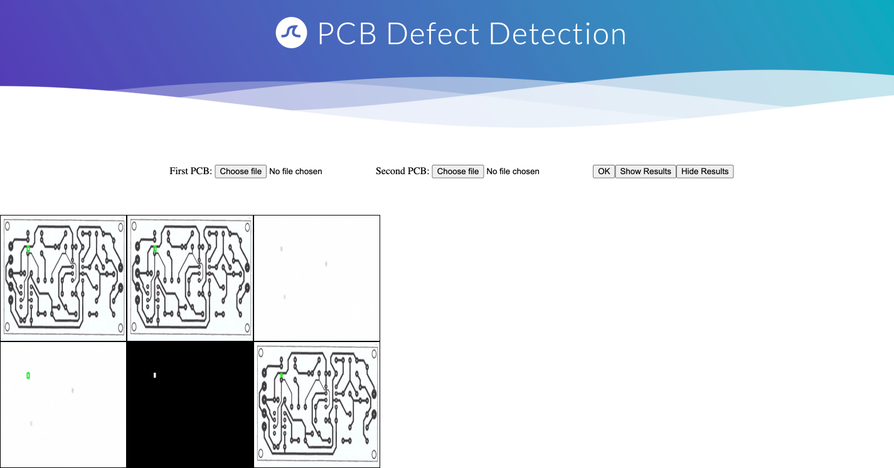

# PCB Defect detection
This Open Source project is about detecting defects in Image using morpholigical subtractions.

Input Images are two PCB Images and output is the defect detections.

Example:

Imput Image 1:

Try this markdown:

Defect Detection

Web Portal:

